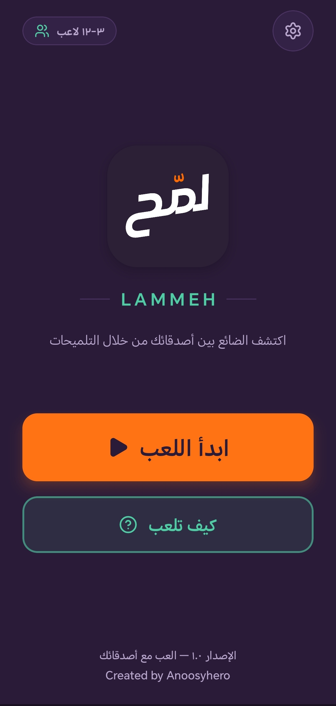
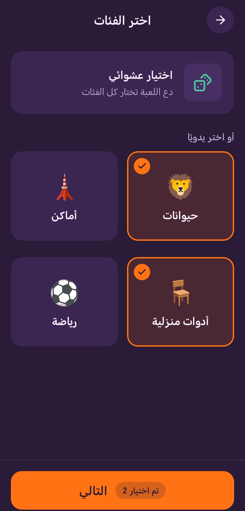
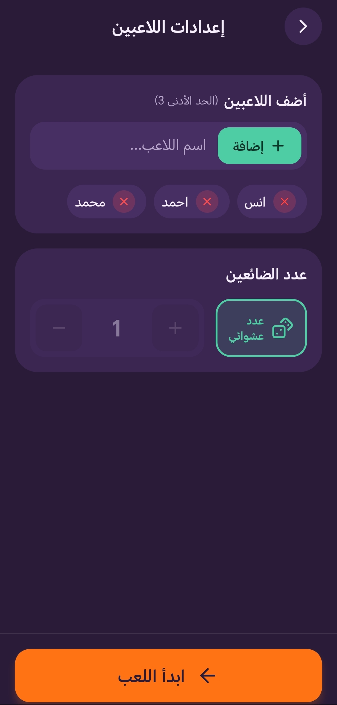
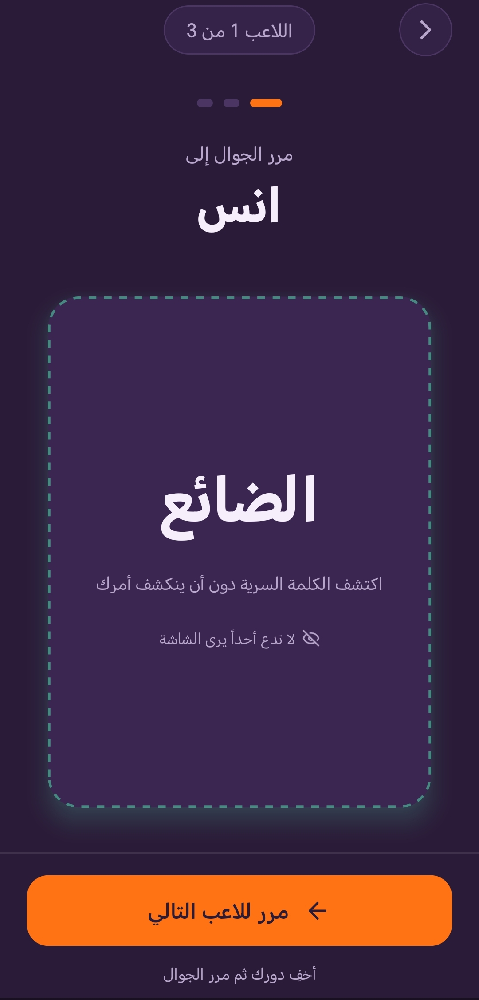
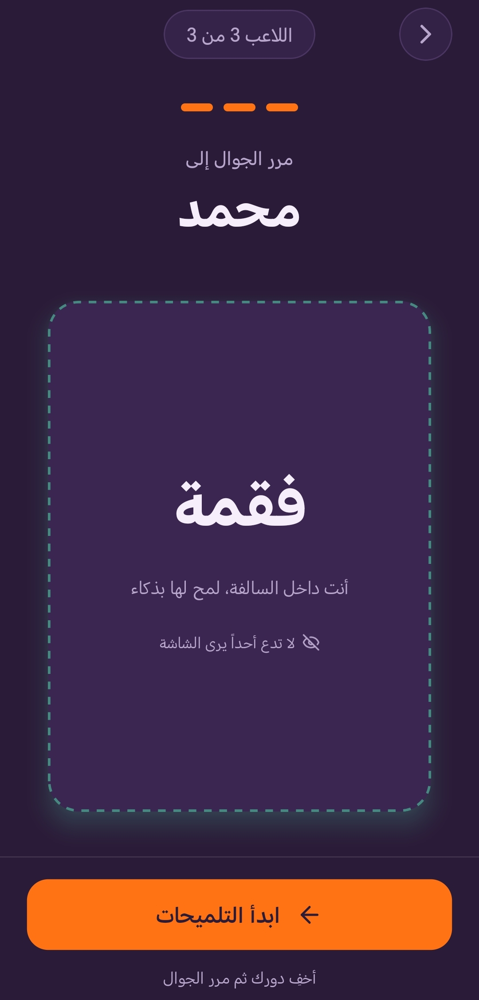
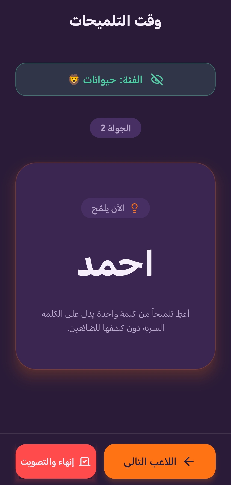
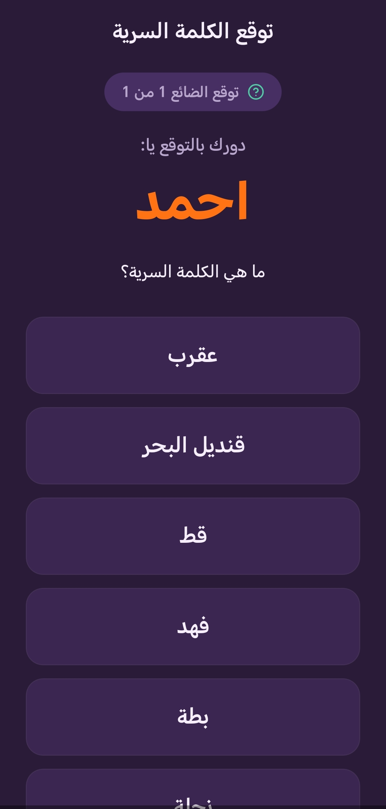
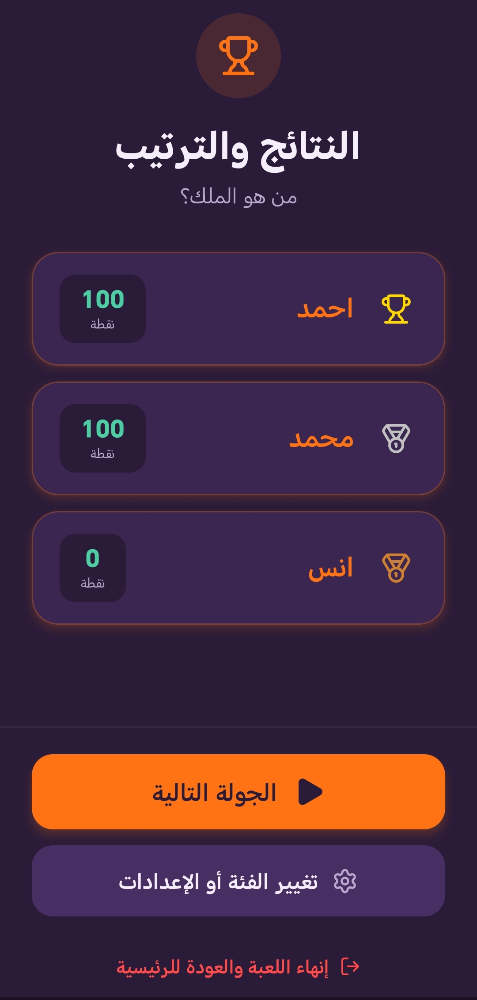

# 🕵️‍♂️ Lammeh (لمّح) - Social Party Game

<p align="center">
  
</p>

Lammeh is an engaging offline multiplayer social deduction game designed for friends and family gatherings. Built with React Native and TypeScript, the game challenges players to use clever hints to identify the "Lost" (الضائع) player who doesn't know the secret word, while the Lost tries to blend in and guess the word without being caught.

## ✨ Features

* **👥 Offline Multiplayer:** Play with 3 to 12 players on a single device, making it the perfect companion for road trips, cafes, and parties.
* **🎭 Dynamic Roles:** Randomized role assignments each round, ensuring a unique experience where anyone could be the "Lost" player.
* **🗂️ Diverse Categories:** A wide variety of built-in word categories (Animals, Places, Sports, Household items, etc.) with a randomizer option.
* **🧠 Strategic Gameplay:** Dedicated interactive phases for turn-based hinting and final guessing, testing players' creativity and deduction skills.
* **📊 Automated Leaderboard:** Real-time points calculation and a competitive ranking system displayed at the end of the game.
* **📱 Seamless UI/UX:** A beautifully crafted, RTL-supported Arabic user interface with smooth transitions and intuitive native navigation.
* **💾 Local Storage:** Utilizes SQLite for robust and seamless local data management, requiring zero internet connection to play.

## 🛠️ Tech Stack

* **Framework:** React Native (Expo)
* **Language:** TypeScript, JavaScript (JSX)
* **Database:** SQLite
* **Deployment & Build:** EAS Build, Google Play Console
* **Version Control:** Git & GitHub

## 🎨 System Screenshots

### ⚙️ Game Setup
| Select Category | Add Players |
| :---: | :---: |
|  |  |

### 🎭 Role Reveal
| The "Lost" Player | The Secret Word |
| :---: | :---: |
|  |  |

### 🧠 Gameplay & Results
| Hinting Phase | Guessing Phase | Leaderboard |
| :---: | :---: | :---: |
|  |  |  |

> **Note:** To see more images or download the latest release, visit the [Releases](#) section.

## 🚀 Installation & Setup

1. Clone the repository:
   ```bash
   git clone [https://github.com/anas-roshdi/lammeh-app.git](https://github.com/anas-roshdi/lammeh-app.git)
2. Navigate to the project directory:
   ```bash
   cd lammeh-app
3. Install the dependencies:
   ```bash
   npm install
4. Start the development server:
   ```bash
   npx expo start

   
